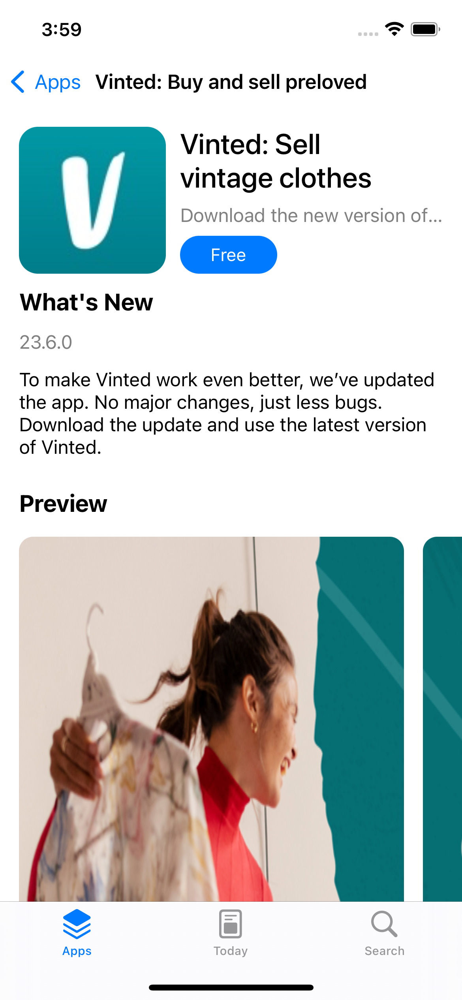
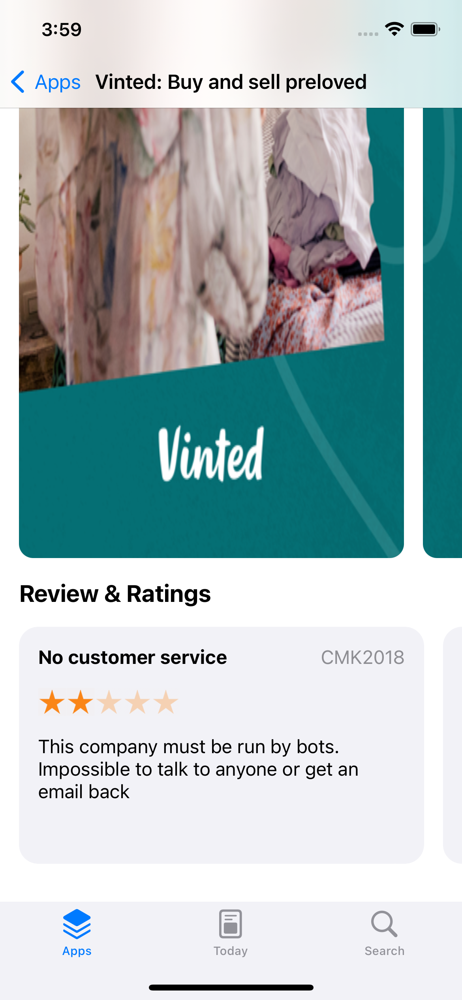

# App Store Clone

 

### Screenshots:

 

### Used
- MVVM Pattern
- Nested UICollectionView
- Programmatically UI
- Stack View
- Auto Layout
- URL Session

### Requirements:
- Xcode 14.1+
- Swift 5+
- iOS 13.0+
